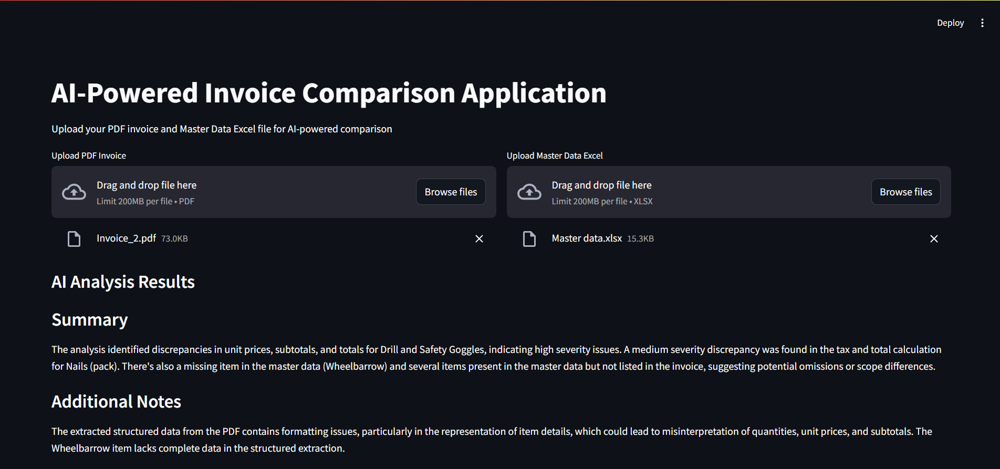
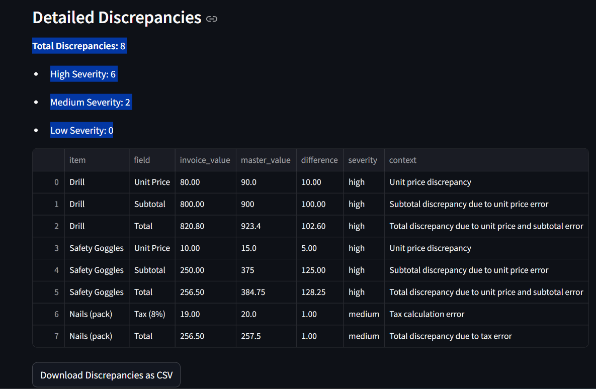
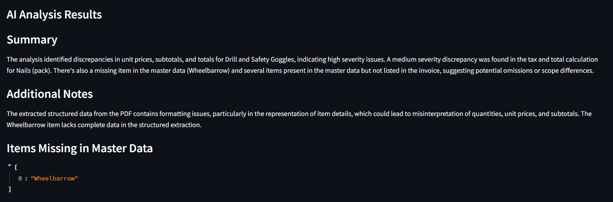

# AI-Powered Invoice Verification System

## Table of Contents
1. [Project Overview](#project-overview)
2. [System Architecture](#system-architecture)
3. [Technical Implementation](#technical-implementation)
4. [User Interface](#user-interface)
5. [Data Flow](#data-flow)
6. [Features and Capabilities](#features-and-capabilities)
7. [Future Enhancements](#future-enhancements)
8. [Conclusion](#conclusion)

## Project Overview

The AI-Powered Invoice Verification System is a Streamlit-based application designed to automate the process of comparing invoice data from PDF files with master data stored in Excel files. The system leverages OpenAI's GPT-4 Turbo model to perform intelligent analysis and identify discrepancies between the two data sources.

### Key Objectives
- Automated extraction of data from PDF invoices
- Intelligent comparison with master data
- Detailed discrepancy reporting
- User-friendly interface for data upload and analysis
- Export of comparison results

## System Architecture

### High-Level Architecture
```
┌─────────────────┐     ┌─────────────────┐     ┌─────────────────┐
│                 │     │                 │     │                 │
│  PDF Upload     │────▶│  Data Extraction│────▶│  OpenAI API     │
│                 │     │                 │     │                 │
└─────────────────┘     └─────────────────┘     └─────────────────┘
        │                       │                       │
        │                       │                       │
        ▼                       ▼                       ▼
┌─────────────────┐     ┌─────────────────┐     ┌─────────────────┐
│                 │     │                 │     │                 │
│  Excel Upload   │────▶│  Data Processing│────▶│  Result Display │
│                 │     │                 │     │                 │
└─────────────────┘     └─────────────────┘     └─────────────────┘
```

### Components
1. **Frontend (Streamlit)**
   - File upload interface
   - Results display
   - Interactive data visualization

2. **Data Processing Layer**
   - PDF text extraction
   - Excel data parsing
   - Data structure conversion

3. **AI Analysis Layer**
   - OpenAI API integration
   - Intelligent comparison logic
   - Discrepancy classification

4. **Output Generation**
   - Detailed discrepancy reports
   - CSV export functionality
   - Summary statistics

## Technical Implementation

### Dependencies
```python
streamlit==1.32.0
pandas==2.2.0
openpyxl==3.1.2
pdfplumber==0.10.3
openai==1.12.0
python-dotenv==1.0.0
```

### Key Functions

1. **PDF Text Extraction**
```python
def extract_pdf_text(pdf_path):
    # Extracts complete text from PDF
    # Returns full text content
```

2. **Structured Data Extraction**
```python
def extract_pdf_data(pdf_path):
    # Extracts structured data from PDF
    # Returns pandas DataFrame
```

3. **AI-Powered Comparison**
```python
def compare_data_with_ai(pdf_df, excel_df, pdf_text):
    # Performs intelligent comparison
    # Returns detailed discrepancy report
```

### Data Structures

1. **PDF Data Structure**
```json
{
    "Item": "string",
    "Quantity": "float",
    "Unit Price": "float",
    "Total": "float"
}
```

2. **Comparison Result Structure**
```json
{
    "missing_in_master": [],
    "missing_in_invoice": [],
    "discrepancies": [
        {
            "item": "string",
            "field": "string",
            "invoice_value": "any",
            "master_value": "any",
            "difference": "float",
            "severity": "string",
            "context": "string"
        }
    ],
    "summary": "string",
    "additional_notes": "string",
    "total_discrepancies": {
        "high": "integer",
        "medium": "integer",
        "low": "integer",
        "total": "integer"
    }
}
```

## User Interface

### Input Interface

*Figure 1: Application input interface showing file upload options*

- PDF file upload
- Excel file upload
- Processing status indicators

### Results Display

*Figure 2: Results display showing summary and discrepancy details*

- Summary section
- Discrepancy details
- Data tables
- Download options

### Detailed Analysis View

*Figure 3: Detailed analysis view showing item-by-item comparison*

- Item-by-item comparison
- Severity indicators
- Context information

## Data Flow

1. **Input Processing**
   ```
   User Upload → File Validation → Data Extraction → Structured Data
   ```

2. **Analysis Flow**
   ```
   Structured Data → AI Processing → Discrepancy Detection → Results Generation
   ```

3. **Output Generation**
   ```
   Results → Formatting → Display → Export Options
   ```

## Features and Capabilities

### Core Features
1. **Intelligent Data Extraction**
   - Complete PDF text extraction
   - Structured data parsing
   - Error handling and validation

2. **Advanced Comparison**
   - Field-by-field analysis
   - Severity classification
   - Context-aware discrepancy detection

3. **Comprehensive Reporting**
   - Summary statistics
   - Detailed discrepancy listing
   - Export capabilities

### Advanced Features
1. **Contextual Analysis**
   - Additional notes from PDF text
   - Severity-based categorization
   - Detailed discrepancy context

2. **Data Export**
   - CSV format
   - Structured data tables
   - Summary statistics


## Conclusion

The AI-Powered Invoice Verification System provides a robust solution for automating the invoice verification process. By leveraging advanced AI capabilities and providing a user-friendly interface, it significantly reduces manual effort while improving accuracy in discrepancy detection.

### Key Benefits
- Reduced manual verification time
- Improved accuracy in discrepancy detection
- Comprehensive reporting capabilities
- Scalable and extensible architecture


